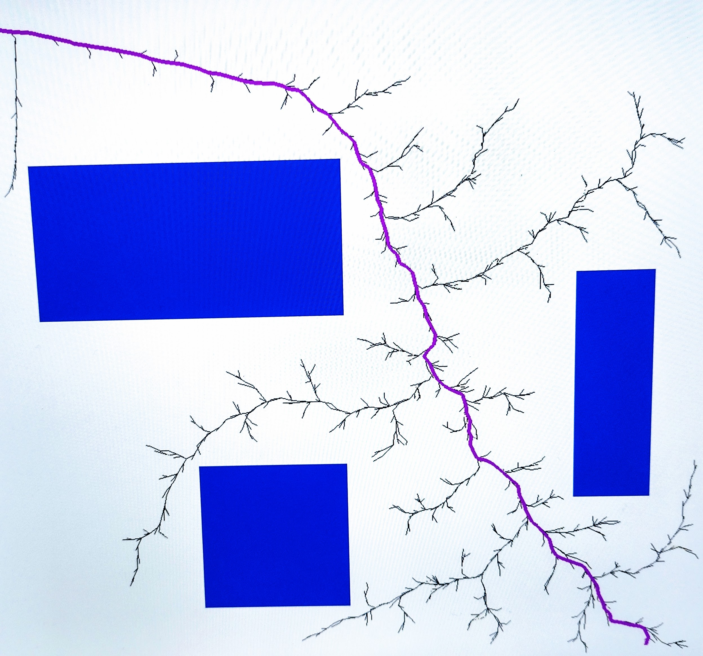

* unzip the file to a folder of your choice
* open both the files RRT_Star_Main.py and Function.py in a code editor preferably VS Code
* Run the RRT_Star_Main.py the program will start to execute
* Output 1, selecting random start and goal coordinates.

* Output 2, selecting different start and goal coordinates to show the generalization of code

* Checking the hybridized goal biased - RRT* algorithm where ther randomly sampled points are generated scloser to the goal point, thus ensuring faster convergence
